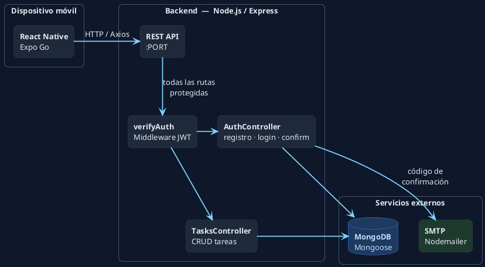
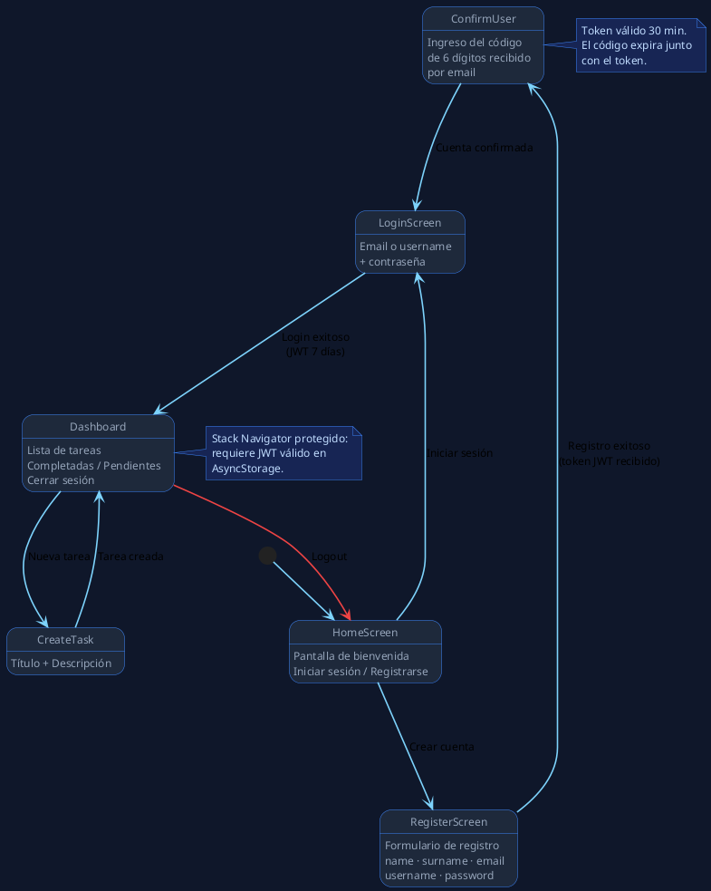
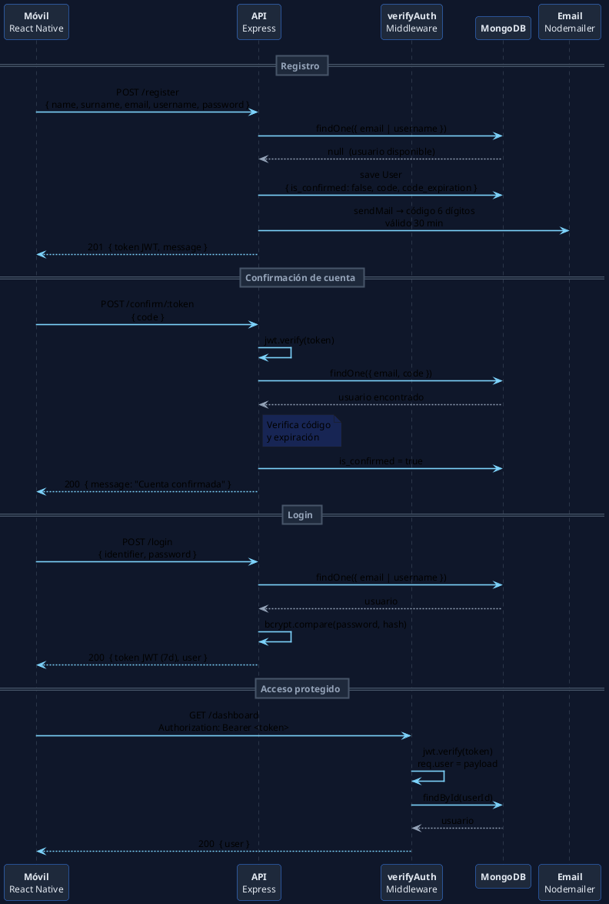
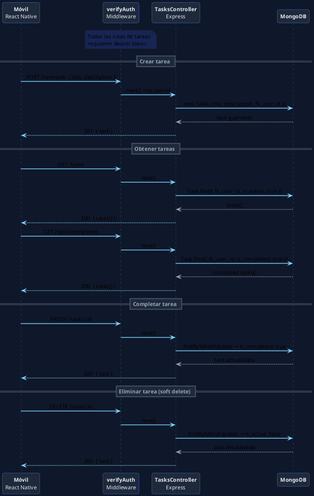
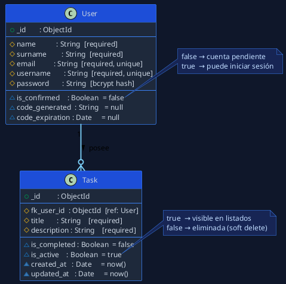

# Mi primera aplicación con React Native

> **Estado**: En desarrollo

## Descripción

Aplicación fullstack de gestión de tareas con autenticación de usuarios. Incluye una API REST en Node.js/Express y una app móvil con React Native (Expo).

---

## Arquitectura general



---

## Estructura del repositorio

```
├── backend/
│   ├── app.js                  # Configuración Express, CORS, rutas
│   ├── server.js               # Arranque del servidor + conexión DB
│   ├── index.js                # Entry point
│   ├── config/
│   │   ├── mongodb.config.js   # Conexión a MongoDB
│   │   └── mail.config.js      # Configuración Nodemailer
│   ├── controllers/
│   │   ├── auth.controller.js  # Registro, confirmación, login, dashboard
│   │   └── tasks.controller.js # CRUD de tareas
│   ├── middlewares/
│   │   └── verify-auth.js      # Verificación de JWT
│   ├── models/
│   │   ├── User.js             # Modelo de usuario
│   │   └── Task.js             # Modelo de tarea
│   ├── routes/
│   │   ├── auth.routes.js
│   │   └── tasks.routes.js
│   └── tests/
│       ├── auth.test.js
│       └── tasks.controller.test.js
│
└── frontend/
    ├── App.js
    ├── src/
    │   ├── components/
    │   │   └── TaskCard.js
    │   ├── context/
    │   │   ├── AuthContext.js
    │   │   └── TaskContext.js
    │   ├── navigation/
    │   │   └── AppNavigation.js
    │   ├── screens/
    │   │   ├── HomeScreen.js
    │   │   ├── LoginScreen.js
    │   │   ├── RegisterScreen.js
    │   │   ├── ConfirmUser.js
    │   │   └── Dashboard.js
    │   └── services/
    │       ├── authService.js
    │       └── tasksService.js
```

---

## Navegación de la app móvil



---

## Tecnologías

| Capa | Tecnología |
|---|---|
| Backend | Node.js, Express 5, JWT, bcrypt, Nodemailer |
| Base de datos | MongoDB, Mongoose |
| Mobile | React Native, Expo, React Navigation |
| Testing | Jest, Babel |

---

## API — Endpoints

Base URL: `http://localhost:<PORT>`

### Autenticación

| Método | Endpoint | Auth | Descripción |
|---|---|---|---|
| `POST` | `/register` | ❌ | Registra un nuevo usuario y envía código de confirmación por email |
| `POST` | `/confirm/:token` | ❌ | Confirma la cuenta usando el token JWT y el código recibido por email |
| `POST` | `/login` | ❌ | Inicia sesión, devuelve JWT de acceso (7 días) |
| `GET` | `/dashboard` | ✅ | Devuelve los datos del usuario autenticado |

#### `POST /register`
**Body:**
```json
{
  "name": "Juan",
  "surname": "Pérez",
  "email": "juan@example.com",
  "username": "juanp",
  "password": "secreto123"
}
```
**Respuesta 201:**
```json
{
  "message": "Usuario registrado exitosamente. Revisa tu correo para confirmar tu cuenta.",
  "token": "<jwt_token>"
}
```

---

#### `POST /confirm/:token`
**Params:** `token` — JWT recibido en el registro  
**Body:**
```json
{ "code": "123456" }
```
**Respuesta 200:**
```json
{ "message": "Cuenta confirmada exitosamente, ahora puedes iniciar sesión." }
```

---

#### `POST /login`
**Body:**
```json
{ "identifier": "juan@example.com", "password": "secreto123" }
```
> `identifier` puede ser email o username.

**Respuesta 200:**
```json
{
  "token": "<jwt_token>",
  "user": { "id": "...", "name": "Juan", "surname": "Pérez", "email": "...", "username": "..." }
}
```

---

#### `GET /dashboard`
**Header:** `Authorization: Bearer <token>`  
**Respuesta 200:**
```json
{ "user": { "name": "Juan", "email": "...", ... } }
```

---

### Tareas
> Todos los endpoints de tareas requieren `Authorization: Bearer <token>`.

| Método | Endpoint | Descripción |
|---|---|---|
| `POST` | `/new-task` | Crea una nueva tarea |
| `GET` | `/tasks` | Obtiene todas las tareas del usuario |
| `GET` | `/tasks/completed` | Obtiene solo las tareas completadas |
| `GET` | `/tasks/:id` | Obtiene una tarea por ID |
| `PATCH` | `/tasks/:id` | Marca una tarea como completada |
| `DELETE` | `/tasks/:id` | Elimina (desactiva) una tarea |

#### `POST /new-task`
**Body:**
```json
{ "title": "Mi tarea", "description": "Descripción de la tarea" }
```
**Respuesta 201:**
```json
{ "message": "Tarea creada exitosamente", "task": { ... } }
```

---

#### `GET /tasks`
**Respuesta 200:**
```json
{ "tasks": [ { "_id": "...", "title": "...", "is_completed": false, ... } ] }
```

---

#### `PATCH /tasks/:id`
Marca la tarea `is_completed: true`.  
**Respuesta 200:**
```json
{ "message": "Tarea completada exitosamente", "task": { ... } }
```

---

#### `DELETE /tasks/:id`
Realiza un **soft delete** (`is_active: false`).  
**Respuesta 200:**
```json
{ "message": "Tarea eliminada exitosamente", "task": { ... } }
```

---

## Flujo de autenticación



---

## Flujo de tareas



---

## Modelos de datos



---

## Testing

El backend cuenta con tests unitarios implementados con **Jest**, usando mocks para aislar las dependencias (MongoDB, bcrypt, JWT, Nodemailer).

### Cobertura actual

| Archivo | Suite | Tests |
|---|---|---|
| `auth.test.js` | Registro de usuarios | 4 tests |
| `auth.test.js` | Confirmación de cuenta | 7 tests |
| `auth.test.js` | Login de usuarios | 6 tests |
| `tasks.controller.test.js` | TasksController | 1 test |

### Casos testeados

**Registro** — campos faltantes · usuario duplicado · registro exitoso + envío de email · error interno  
**Confirmación** — token/código faltante · token inválido · usuario no encontrado · cuenta ya confirmada · código incorrecto · código expirado · confirmación exitosa · error interno  
**Login** — campos faltantes · usuario no encontrado · cuenta sin confirmar · contraseña incorrecta · login exitoso + generación de JWT · error interno  
**Tareas** — creación exitosa de tarea

### Ejecutar tests

```bash
cd backend
npm test
```

---

## Variables de entorno (backend)

Crear un archivo `.env` en `backend/`:

```env
PORT=3000
MONGO_URI=mongodb://localhost:27017/tu_base_de_datos
JWT_SECRET=tu_secreto_jwt
EMAIL_USER=tu_correo@gmail.com
EMAIL_PASS=tu_contraseña_o_app_password
```

---

## Instalación y ejecución

### Backend
```bash
cd backend
npm install
npm run dev
```

### Tests (backend)
```bash
cd backend
npm test
```

### Frontend móvil
```bash
cd frontend
npm install
npx expo start
```

---

## Visualizar los diagramas PlantUML

Los diagramas están escritos en sintaxis [PlantUML](https://plantuml.com/). Para renderizarlos:

| Entorno | Cómo |
|---|---|
| **VS Code** | Extensión [PlantUML](https://marketplace.visualstudio.com/items?itemName=jebbs.plantuml) — `Alt + D` para previsualizar |
| **Online** | Pegar el código en [plantuml.com/plantuml](https://www.plantuml.com/plantuml/uml/) |
| **GitLab** | Renderizado nativo en Markdown |
| **IntelliJ / PyCharm** | Plugin PlantUML Integration |

---

## Santiago Montironi

Proyecto personal: primera app en React Native, en desarrollo.
